# 🚀 RARE: Resume Analysis & Ranking Engine

### *AI-Powered Semantic Screening & Intelligent Candidate Reranking Platform*

---

## 📖 Overview

**RARE (Resume Analysis & Ranking Engine)** is an advanced, production-grade recruitment intelligence platform built to eliminate the pitfalls of traditional Applicant Tracking Systems (ATS).

Legacy systems rely heavily on rigid, exact keyword matching, frequently missing high-potential candidates who use alternative phrasing. **RARE solves this by introducing deep semantic context.** By leveraging dense vector representations, hybrid sparse-dense retrieval strategies, and an isolated multi-layer LLM reranking layer, RARE interprets the true intent, experience depth, and skills of a candidate relative to a job description. The result is a lightning-fast, transparently scored leaderboard built for modern, high-volume talent sourcing.

---

## ⚡ The Paradigm Shift

| Legacy ATS Systems | The RARE Advantage |
| --- | --- |
| **Exact Keyword Matching** (Misses synonyms/context) | **Deep Semantic Intuition** (Understands conceptual skills) |
| **Strict/Rigid Search Filters** | **Hybrid Retrieval** (70% Vector Distance + 30% Keyword Salience) |
| **Manual Application Auditing** | **Automated Leaderboard Isolation** via LayerWise Reranking |
| **Zero Interpretability** (Black box processing) | **Transparent Match Analytics** |
| **High Latency Structural DB Queries** | **Sub-millisecond Vector Query Isolation** via Qdrant |

---

## 🏗 System Architecture & Workflow

```mermaid
%%{init: { 'themeVariables': { 'fontSize': '20px', 'fontFamily': 'arial' } } }%%
flowchart LR
    %% Professional Architecture - Clear & Visible
    classDef inputStyle fill:#F8FAFC,stroke:#64748B,stroke-width:2px
    classDef procStyle fill:#2563EB,color:#ffffff,stroke:#1D4ED8,stroke-width:2px
    classDef aiStyle fill:#10B981,color:#ffffff,stroke:#059669,stroke-width:2px
    classDef dataStyle fill:#64748B,color:#ffffff,stroke:#475569,stroke-width:2px
    classDef outStyle fill:#8B5CF6,color:#ffffff,stroke:#7C3AED,stroke-width:2px

    subgraph INPUT["INPUT"]
        direction TB
        IN1["Resume Files<br/>PDF/Image/Text"]:::inputStyle
        IN2["Job Description<br/>Recruiter Query"]:::inputStyle
    end

    subgraph PROC["PROCESSING"]
        direction TB
        P1["Text Extraction<br/>PDF/OCR Parser"]:::procStyle
        P2["Embedding Generation<br/>FastEmbed • 384-dim"]:::procStyle
    end

    subgraph STORE["STORAGE"]
        direction TB
        DB1["Vector Database<br/>Qdrant • Embeddings"]:::dataStyle
    end

    subgraph AI["AI RANKING"]
        direction TB
        R1["Hybrid Search<br/>(70% Vector + 30% Keyword)"]:::aiStyle
        R2["LLM Reranker<br/>Layerwise Model"]:::aiStyle
    end

    subgraph OUTPUT["OUTPUT"]
        direction TB
        OUT1["Ranked Candidates<br/>AI Match Scores"]:::outStyle
        OUT2["Dashboard API<br/>Flask Endpoints"]:::outStyle
    end

    subgraph LEG["LEGEND"]
        direction TB
        L1["INPUT nodes"]:::inputStyle
        L2["PROCESSING nodes"]:::procStyle
        L3["AI nodes"]:::aiStyle
        L4["DATA nodes"]:::dataStyle
        L5["OUTPUT nodes"]:::outStyle
    end

    IN1 --> P1
    IN2 --> R1
    P1 --> P2
    P2 --> DB1
    DB1 --> R1
    R1 --> R2
    R2 --> OUT1
    OUT1 --> OUT2

    style INPUT fill:#F8FAFC,stroke:#CBD5E1
    style PROC fill:#EFF6FF,stroke:#BFDBFE
    style STORE fill:#F1F5F9,stroke:#E2E8F0
    style AI fill:#ECFDF5,stroke:#D1FAE5
    style OUTPUT fill:#F5F3FF,stroke:#DDD6FE
    style LEG fill:#FFFFFF,stroke:#CBD5E1

    linkStyle default stroke:#64748B,stroke-width:2px

```



---

## ✨ Features

* **Robust Document Processing:** Native multi-format intake (PDF, Images, Plain Text) backed by OCR pipelines for automated structural feature extraction.
* **Dual-Engine Hybrid Retrieval:** Combines the high-recall capabilities of semantic vector embeddings ($BGE-small-en-v1.5$) with the precision of keyword matching to ensure foundational domain terminology is never weighted incorrectly.
* **Deterministic Multi-Layer Reranking:** Implements a localized `layerwise_engine` that passes initial high-recall matches through specialized LLM evaluation stages, producing precise context-aware match scoring.
* **Production-Ready Data Store:** Integrated with Qdrant for real-time indexing, low-latency collection management, and complex payload filtering.
* **Intuitive Talent Dashboard:** A modern UI designed with React and Tailwind CSS providing instant access to global candidate scores, technical breakdowns, and sorting capabilities.

---

## 🛠 Tech Stack

* **Frontend:** React.js, Tailwind CSS, Axios (State management & HTTP communications)
* **Core Backend:** Python 3.11, FastAPI, Uvicorn (Asynchronous routing layer)
* **Data Processing:** Pandas, NumPy, Native Regular Expression Parsers
* **Vector Architecture:** Qdrant DB (Vector Store), HuggingFace Transformers (BGE Embeddings)

---

## 📂 Project Anatomy

```text
RARE-ResumeAnalysisRankingEngine
│
├── ranking/
│   ├── __init__.py
│   ├── layerwise_engine.py       # Isolated LLM evaluation & scoring logic
│   └── schemas.py                # Strict Pydantic data validation contracts
│
├── ranking_test/
│   └── test_layerwise_engine.py  # Comprehensive engine evaluation suites
│
├── storage/
│   ├── __init__.py
│   ├── config.py                 # Engine parameters and environment mappings
│   ├── qdrant_setup.py           # Collection initializers and index optimization
│   ├── retrieval.py              # Hybrid search execution & rank fusion
│   ├── sample_resumes.py         # Mock candidate pools for sandboxed testing
│   └── app.py                    # Internal storage engine wrappers
│
├── docs/
│   └── architecture.png          # System architecture assets
│
├── main.py                       # Global application entrypoint (FastAPI)
├── pipeline_optimized.py         # End-to-end unified batch processing worker
├── requirements.txt              # Explicit dependency manifest
└── README.md

```

---

## ⚙ Installation & Deployment

### 1. Repository Initialization

```bash
git clone https://github.com/Franz-kingstein/RARE-ResumeAnalysisRankingEngine.git
cd RARE-ResumeAnalysisRankingEngine

```

### 2. Microservice Environment Provisioning

```bash
# Environment generation
python -m venv venv

# Activation
# UNIX (Linux / macOS)
source venv/bin/activate
# Windows
.\venv\Scripts\activate

# Dependency installation
pip install -r requirements.txt

```

### 3. Execution

To launch the core engine API cluster, execute:

```bash
uvicorn main:app --reload

```

### 4. Client Presentation Layer

```bash
cd frontend
npm install
npm run dev

```

---

## 📡 Core API Gateway

| Method | Endpoint | Payload / Scope | Function |
| --- | --- | --- | --- |
| `POST` | `/upload` | `multipart/form-data` | Accepts raw document streams, runs OCR, and extracts structural text string blocks. |
| `POST` | `/embed` | `{"text": "string"}` | Conversional handling mapping inputs into standard 384-dimensional arrays. |
| `POST` | `/rank` | `{"jd_id": "uuid", "limit": 10}` | Triggers the Hybrid Retrieval engine and routes targets through the LayerWise Reranker. |
| `GET` | `/results` | Query Params: `job_id` | Fetches structural ranking payloads, metadata vectors, and absolute AI alignment scores. |

---

## 📈 Roadmap & Scalability Enhancements

* **Explainable AI (XAI) Matrix:** Integrate transparent breakdown logs detailing *why* a candidate was reranked higher, highlighting specific overlapping contextual experiences.
* **Automated Skill Gap Maps:** Visual analytics showing missing certifications, tool paths, or architectural experience parameters for high-tier edge candidates.
* **Predictive Interview Blueprints:** Dynamic Generation of technical challenge prompts based on the candidate's custom experience profile and targeted JD holes.
* **Localized Feedback Loop:** Reinforcement mechanisms allowing internal recruiter actions (accept/reject) to fine-tune retrieval weights dynamically.

---

## 👥 Hackathon Contribution

* **Platform Design & Engineering:** Built with focus during an intensive AI Recruitment Hackathon sprint.

---

📄 **License:** *This architecture is deployed open for educational, academic research, and evaluation workflows.*
